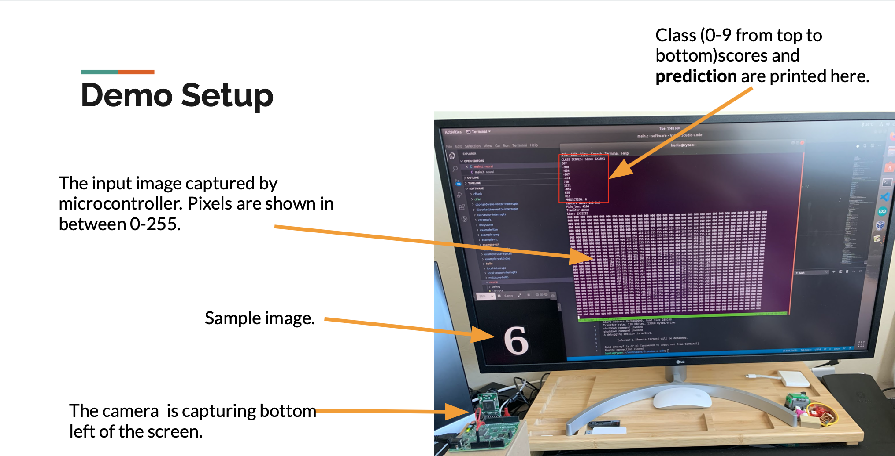

After running the generator for a network, copy main.h and only copy network part of the main.c to the target system source code.

To do basic unit test, compile exisiting main.c file and execute, it should print exactly same result as in python code.

The longer demo video: https://www.youtube.com/watch?v=nQN_5fDQbI4

